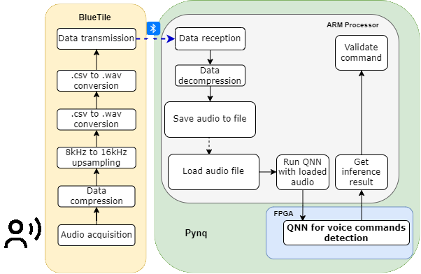

<div id="top"></div>

<!-- PROJECT SHIELDS -->
[![Contributors][contributors-shield]][contributors-url]
[![Forks][forks-shield]][forks-url]
[![Stargazers][stars-shield]][stars-url]
[![Issues][issues-shield]][issues-url]
[![MIT License][license-shield]][license-url]
[![LinkedIn][linkedin-shield]][linkedin-url]


<!-- PROJECT LOGO -->
<br />
<div align="center">
  <a href="https://github.com/github_username/repo_name">
    
  </a>
</div>

<!-- ABOUT THE PROJECT -->
## About The Project

<p align="center">
  
</p>

[//]: <Here's a blank template to get started: To avoid retyping too much info. Do a search and replace with your text editor for the following: `github_username`, `repo_name`, `twitter_handle`, `linkedin_username`, `email`, `email_client`, `project_title`, `project_description`>

### Scope
There are two main scopes in this project:
- Low power wireless sensor nodes for data acquisition and transmission, and
compression of data before transmission.
- FPGA accelerated algorithms on embedded platforms that allow efficient analysis
of data.

### Objective(s)
Implementation of firmware for a small low power wireless sensor node (**WSN**)
for data acquisition, compression and wireless transmission using BLE.
Implementation of applications running on a central processing node (**CPN**). The
CPN is a heterogeneous platform with CPU and FPGA. The applications will run
on the CPU and use the FPGA for data analysis speed up.
- An application for audio data reception using BLE and data
decompression.
- An application that uses FPGA accelerated algorithms based on Neuronal networks to detect voice commands on the re  ceived audio
data.
- An audio stream that connects both applications and allows for the real
time analysis of the collected data.

### Domains
Edge computing, wireless sensor node, low power wireless communication, FPGA accelerated algorithms, neuronal networks.


<p align="right">(<a href="#top">back to top</a>)</p>


### Functional Specification

**Wireless Sensor Node** (**WSN**): The wireless sensor node to be used will be the
STMicroelectronics [STEVAL-BCN002V1B](https://www.st.com/en/evaluation-tools/steval-bcn002v1b.html), aka BlueTile. This device has everything we need to fulfill our requirements:
- BlueNRG-2: Bluetooth Low Energy single-mode system-on-chip
- MP34DT05TR-A: MEMS audio sensor omnidirectional digital
microphone.
- [STSW-BLUETILE-DK](https://www.st.com/en/embedded-software/stsw-bluetile-dk.html) SDk with demo firmware including the BlueVoice library which applies ADPCM compression on a PCM audio stream and then performs half-duplex (one-way) streaming of compressed data over a wireless BLE link.

**In-node operations**: The BlueTile will perform:
- Audio acquisition
- Audio compression
- Audio transmission

**Data transfer**: The data transfer between the WSN and the CPN will be performed via [**Bluetooth Low Energy**](https://www.bluetooth.com/learn-about-bluetooth/tech-overview/) (**BLE**), as it fits our requirements of sampling frequency and power constraints.

**Central processing Node** (**CPN**): As CPN, the [**TUL PYNQ-Z2**](https://www.tulembedded.com/FPGA/ProductsPYNQ-Z2.html) developer kit will be used:
- Zynq-7000 SoC
- USB-JTAG Programming circuitry
- USB OTG 2.0
- One 10/100/1G Ethernet
- HDMI Input and Output
- I2S interface with 24bit DAC with 3.5mm TRRS jack
- Line-in with 3.5mm jack
- 512 Mbyte DDR3 with 16-bit bus @ 1050 Mbps
- 128 Mbit Quad-SPI Flash
- Micro SD card connector
- Switches and LEDs

**Operations in the CPN**: The main operations in the CPN are:
- Audio reception.
- Audio decompression.
- Voice command detection using a QNN running on the FPGA
- Command validation.
- Command execution.


<!-- GETTING STARTED -->
## Getting Started

### Prerequisites

It is necessary to ha a Virtual Machine with the following setup:
- [Ubuntu 18.04 Bionic Beaver](https://releases.ubuntu.com/18.04/)
- At least 300GB of virtual disk, and maximum resources possible.
- [Xilinx Vitis HLS Suite v2020.1](https://www.xilinx.com/support/download/index.html/content/xilinx/en/downloadNav/vitis/archive-vitis.html)
- [PetaLinux Tools v2020.1](https://www.xilinx.com/support/download/index.html/content/xilinx/en/downloadNav/embedded-design-tools/archive.html) (and all relative dependences which may be asked)

### Build Process

1. Download agnostic image and rootfs (arm version) from [PYNQ forum discussion](https://discuss.pynq.io/t/prebuilt-board-agnostic-root-filesystem-and-prebuilt-source-distribution-binaries-for-version-2-6-1/5127)
2. Open a terminal
3. Clone the PYNQ repo and checkout the commit relative to v2.6.0
  ```sh
  git clone https://github.com/Xilinx/PYNQ.git
  cd PYNQ
  git checkout 318258111f2ab0a2a73d06860f20e5a095b3cf08
  cd ..
  ```
4. Relax all access permissions on the PYNQ directory
  ```sh
  sudo chmod -R 777 <PYNQ repository>/*
  ```
5. Configure Vitis, Vivado, and PetaLinux environment
   </br>(note that Xilinx installation folder is `~/tools/Xilinx`)
  ```sh
  source <PYNQ repository>/sdbuild/scripts/setup_host.sh #(this may take several minutes)
  source ~/tools/Xilinx/Vitis/2020.1/settings64.sh
  source ~/tools/Xilinx/Vivado/2020.1/settings64.sh
  source ~/tools/Xilinx/petalinux-v2020.1/settings.sh
  ```
6. Create bluetooth config file to be read by PetaLinux and Yocto
  ```sh
  touch <PYNQ repository>/sdbuild/boot/meta-pynq/recipes-kernel/linux/linux-xlnx/bluetooth.cfg
  ```

7. Populate file with the needed kernel options (more info [here](https://elinux.org/Minnowboard:Adding_Bluetooth_Support_To_Your_Kernel))
  ```sh
  CONFIG_BT=m
  CONFIG_BT_RFCOMM=m
  CONFIG_BT_RFCOMM_TTY=y
  CONFIG_BT_BNEP=m
  CONFIG_BT_BNEP_MC_FILTER=y
  CONFIG_BT_BNEP_PROTO_FILTER=y
  CONFIG_BT_CMTP=m
  CONFIG_BT_HIDP=m
  CONFIG_BT_L2CAP=m
  CONFIG_BT_SCO=m
  CONFIG_BT_HCIUSB=m
  CONFIG_BT_HCIUSB_SCO=m
  CONFIG_BT_HCIBTUSB=m
  CONFIG_BT_HCIBTSDIO=m
  CONFIG_BT_HCIUART=m
  CONFIG_BT_HCIUART_H4=y
  CONFIG_BT_HCIUART_BCSP=y
  CONFIG_BT_HCIUART_ATH3K=y
  CONFIG_BT_HCIUART_LL=y
  CONFIG_BT_HCIUART_3WIRE=y
  CONFIG_BT_HCIBCM203X=m
  CONFIG_BT_HCIBPA10X=m
  CONFIG_BT_HCIBFUSB=m
  CONFIG_BT_HCIDTL1=m
  CONFIG_BT_HCIBT3C=m
  CONFIG_BT_HCIBLUECARD=m
  CONFIG_BT_HCIBTUART=m
  CONFIG_BT_HCIVHCI=m
  CONFIG_BT_MRVL=m
  CONFIG_BT_MRVL_SDIO=m
  CONFIG_BT_ATH3K=m
  CONFIG_BT_WILINK=m
  ```
8. Open with a text editor the following file (`nano` is here used just as an example)
   <br>(Note: steps 8 and 9 are needed to add bluetooth support to your linux kernel)
  ```sh
  nano <PYNQ repository>/sdbuild/boot/meta-pynq/recipes-kernel/linux/linux-xlnx_%.bbappend
  ```
9. Add the following line to the file
  ```sh
  SRC_URI += " file://bluetooth.cfg"
  ```
10.  Enter build directory
  ```sh
  cd <PYNQ repository>/sdbuild/
  ```
11.  Launch `make` command
    <br>(Note: this might take several hours. If prompted, insert password. The `download repository` refers to the one used in step 1 of the *Build Process*.)
  ```sh
  make PREBUILT=<download repository>/bionic.arm.2.6.0_2020_10_19.img BOARDS="Pynq-Z2"
  ```

12.  At the end of the process the `bionic.arm.2.6.0.img` image can be found in the `output` folder of the `build directory`
  ```sh
  cd <PYNQ repository>/sdbuild/output
  ```

### Known Build Issues
- [Resolving download issues (e.g isl-0.20, expat-2.2.6)](https://github.com/crosstool-ng/crosstool-ng/issues/1625). For my system the third solution (Pre-download Source) worked.
- [rsync error](https://discuss.pynq.io/t/pynq-2-7-makefile-recipe-for-target-fails-error-23/4607) (while creating a directory) during build process. For my system the working solution has been applying *Step 4* of the *Build Process*.

### OS First Boot
1. Flash the `bionic.arm.2.6.0.img` image on a micro SD card of sufficient size (at least 16GB of storage). To this scope one may use [Rufus](https://rufus.ie/en/), a free and Open Source utility that helps format and create bootable USB flash drives, such as USB keys/pendrives, memory sticks, etc. .
2. Insert the micro SD card into the proper PYNQ-Z2 board slot.
3. Move the boot jumper to the SD position (this tells the board where to find the OS).
4. Power on the board and wait for the system to boot.
5. Connect the board to a PC via a micro-USB cable and open a [Serial Terminal](https://www.putty.org/) selecting a baud rate of 115200.
6. Enjoy your fresh Pynq Linux distribution :)

### Bluetooth Driver installation
If using the same USB adapter of this project, namely the [ASUS USB-BT400](https://www.asus.com/fr/networking-iot-servers/adapters/all-series/usbbt400/), a very well written guide for the driver installation can be find [here](https://gist.github.com/ssledz/69b7f7b0438e653c08c155e244fdf7d8).

<p align="right">(<a href="#top">back to top</a>)</p>

## FINN Framework Setup

The keyword spotting example is currently configured for running on the Pynq-Z1 board only.
The Pynq-Z2 board contains the jupyter notebook tutorial related to the above mentioned example
but in order to correctly run the Quantum Neural Network(QNN) accelerator on the platform the related bitfile (**.bit**) is
required, together with the Hardware Handoff (```.hwh```) file; this last file is generated by the Vivado IP integrator when
generating the bitstream and contains and it is used by Pynq boards to detect IP version, interrupts, reset and other
control signals.

### Build process for for Pynq-Z2
In order to build the bitfiles for the KWS neural network targeting the Pynq-Z2 board we must first build the related HLS IP files. 
The Starting point is the set of guidelines provided by the GitHub repository of 
[finn-examples](https://github.com/Xilinx/finn-examples/tree/main/build).

1. Download [Vitis Development Kit](https://www.xilinx.com/support/download/index.html/content/xilinx/en/downloadNav/vitis/2022-1.html).
For the project version **2022.1** is recommended, since newer versions may have issues with the FINN compiler.
2. [Install Docker engine](https://docs.docker.com/engine/install/) and configure it to [run without root](https://docs.docker.com/engine/install/linux-postinstall/#manage-docker-as-a-non-root-user).
3. Clone the FINN examples from the official GitHub repo:
  ```sh
	git clone https://github.com/Xilinx/finn-examples
  ```
4. clone the FINN compiler at the appropriate repo by executing the ``` get-finn-sh ``` script available under the **build** directory.
5. Execute ```./run-docker.sh quicktest``` to verify the installation.
6. Customize the ```./run-docker.sh ``` script by adding the following environmental variables:
    1. ``` FINN_XILINX_PATH ```: it is the absolute path in which Xilinx tools are installed.
    2. ``` FINN_XILINX_VERSION ```: it refers to the currently installed Xilinx tools version.
    
7. Move into the ```finn``` folder generated by running the script at step 4.
8. Start compiling by running the  ```./run-docker.sh ``` script, providing the absolute path to the targeted example:
  ```sh
 bash run-docker.sh build_custom ***path_to_target_example***
  ```

At the end of the build, all the output files are available in a dedicated directory under the targeted example folder (in our case it is the ```kws``` folder).
in order to target the Pynq-Z2 boardwe are not interested in the bitfile itself but to the IP files, which must be integrated into a Vivado
IPI design usign AXI stream interfaces.

For what concerns the integration of the generated IP, we must create a new project with the **Vitis HLS** tool, targeting the Pynq-Z2 board;
then we need to create a **"new block design"**. The target IP files must be visible to the tool, so we need to add the IP
repository to the project settings first; proceeding with the flow, we must add the required blocks which are:
1. The Zynq Processing system.
2. Our HLS IP.
3. The Processor System Reset block.
4. AXI streams and interfaces to glue the other blocks together.

After the creation of the block design we must validate it (click on **"Validate design"**); if the validation completes without errors
the next step consists in creating the HLS wrapper of the block design; then the HLS tool can generate the bitstream (click on **"Generate
Bitsream"** on the Vivado project).
A useful feature offered by Vivado is the possibility of generating a ```.tcl``` script which can be executed to replicate the block
design from scratch: to create it simply click on export and then **"Block design tcl"**.
Once the bitfiles and the ```.tcl``` script have been generated give them the same name and copy them into the target directory of the
Pynq-Z2 board.

### Alternative solutions for examples not supported by the Pynq-Z2 board
In case the procedure does not give the desired results, it is possible to take all the required files for the example under analysys
(mainly the bitfiles and the ```.hwh``` files) and load them into the PYNQ-Z2, trying to execute the example contained in the
**"jupyter_notebooks"** folder.

1. The KWS example on jupyter notebooks requires the Google speech Commands dataset, which has also been used for its training.
Such dataset is contained in NumPy files (```.npy```), which is a standard binary file format for 
persisting a single arbitrary NumPy array on a disk.
The above mentioned files are available in .zip format on the GitHub repository of the FINN-examples, inside the [data](https://github.com/Xilinx/finn-examples/releases/download/kws/all_validation_kws_data_preprocessed_py_speech.zip) folder.
2. The dataset files must be moved into the ```data``` directory, which has been created inside the Pynq-Z2 file system at the following path:
	```sh
	/usr/local/lib/python3.6/dist-packages/finn_examples/data/
	```
3. Download the [bitfile](https://github.com/Xilinx/finn-examples/blob/main/finn_examples/bitfiles/bitfiles.zip.link) for the KWS network
(files are named **"kwsmlp-w3a3.bit"** and **"kwsmlp-w3a3.hwh"**)
4. Move the bitfiles and the **.hwh** files under a dedicated ```bitfiles``` directory, created under the path:
	```sh
	/usr/local/lib/python3.6/dist-packages/finn_examples/bitfiles/Pynq-Z2
	```
    The ```.bit``` and the ```.hwh``` file MUST have the same name, otherwise there may be problems
when trying to run the example (it might be that the Pynq board will not be configured correctly).

5. Run the KWS example it is required to [log in to the jupyter notebooks home folder](https://pynq.readthedocs.io/en/v2.5/getting_started.html#connecting-to-jupyter-notebook)
 by using any web browser. The board can also be connected to a router via Ethernet connection: in this case,
 in order to correctly access jupiter notebooks, the local IP address of the board is required. By exploiting
 SSH it is possible to connect to the board and navigate its files but we can simply use a web browser to access
 the examples.

If the objective is to access and/or modify the examples, navigate to the ```finn_examples``` folder and then to the ```4_keyword_spotting.ipynb``` example;
In order to run the example, instead, the procedure is the following:
1. After connecting the board to a router, browse to ```http://<board IP address>:9090```; this will redirect to the login page.
2. Insert username and password (the default username and password is ```xilinx```).
3. Optional: [change the hostname](https://pynq.readthedocs.io/en/latest/getting_started/pynq_z1_setup.html#change-the-hostname)
4. Open the **notebooks** folder.
5. Open the targeted example.
6. Click ```Run``` to start running the first piece of code of the example. Repeatedl click the button in order to advance with the execution.

### Additional informations for the KWS example
The keyword spotting example requires ```.wav``` audio samples to work properly; in addition, the samples must be recorded by using
a **mono** channel insted of a stereo one, otherwise they will not be accepted for evaluation by the network.

The network has been tested with samples recorded at 8 kHz, noticing that most of them are recognized. Since this network is based
on a very simple voice recognition it may be possible that it requires some clear and loud samples, otherwise it may incur in mispredictions.

<p align="right">(<a href="#top">back to top</a>)</p>

## BlueTile Firmware Setup

The procedure to setup the WSN besides is definitely the least complex and is described in the following.

### Build Process for BlueTile
For the purpose of the project it is necessary to build a firmware also for the BlueTile. The source code that is going to be built can found on this repository, more precisely in `pynq22/resources/BlueTile_Audio_FW/STSW-BLUETILE-DK 1.3.0`, and has been kindly provided by [Andrea Pignata](https://github.com/andreapignaz).

1. Download [ARM Keil IDE](https://www.keil.com/download/product/)
2. Since the firmware is made of a fair number of lines of code, the free version of the Keil will ask for a license. A free activation key is provided by ST, which can be found on the [ARM Developer website](https://developer.arm.com/documentation/kan344/1-1/License).
3. Open the `STSW-BLUETILE-DK 1.3.0` project within ARM Keil IDE.
4. Clean Project and then Build.
5. Inside the `Release` folder, you will find the compiled firmware (including a `.hex` file which will be needed later).

Now it is time to flash the built firmare image onto the BlueTile's memory.

6. Download, install, and open the [BlueNRG Flasher Utility](https://www.st.com/en/embedded-software/stsw-bnrgflasher.html) from ST.
7. Connect the BlueTile to the computer with the provided adapter.
8. Select the `.hex` firmware image, the board you want to flash, and press **Flash**.

The BlueTile is now ready to sample audio and send it by means of BLE.

<p align="right">(<a href="#top">back to top</a>)</p>

<!-- USAGE EXAMPLES -->
## Voice Command Detection Process

Once the finn examples are installed on the board we can easily access them by opening
an SSH connection via terminal; by default, the directory containing the examples
is cloned at the path ```/home/xilinx/```, and it is named ```jupyter_notebooks```. All
the related files can be accessed by using the command:
```sh
cd jupyter_notebooks
```
from the home directory.
Any jupyter example can then be accessed and modified by using any text editor (e.g. ```Vim```).

<p align="right">(<a href="#top">back to top</a>)</p>


<!-- ROADMAP -->
<!--## Roadmap

- [] Feature 1
- [] Feature 2
- [] Feature 3
    - [] Nested Feature

See the [open issues](https://github.com/github_username/repo_name/issues) for a full list of proposed features (and known issues).

<p align="right">(<a href="#top">back to top</a>)</p>
-->


<!-- CONTRIBUTING -->
<!--## Contributing

Contributions are what make the open source community such an amazing place to learn, inspire, and create. Any contributions you make are **greatly appreciated**.

If you have a suggestion that would make this better, please fork the repo and create a pull request. You can also simply open an issue with the tag "enhancement".
Don't forget to give the project a star! Thanks again!

1. Fork the Project
2. Create your Feature Branch (`git checkout -b feature/AmazingFeature`)
3. Commit your Changes (`git commit -m 'Add some AmazingFeature'`)
4. Push to the Branch (`git push origin feature/AmazingFeature`)
5. Open a Pull Request

<p align="right">(<a href="#top">back to top</a>)</p>
-->


<!-- LICENSE -->
## License

Distributed under the BSD 3-Clause License. See `LICENSE` for more information.

<p align="right">(<a href="#top">back to top</a>)</p>


<!-- CONTACT -->
## Contact

Project Link: [https://github.com/SoC-Arch-polito/pynq22](https://github.com/SoC-Arch-polito/pynq22)

<p align="right">(<a href="#top">back to top</a>)</p>


<!-- ACKNOWLEDGMENTS -->
## Developers

* Alessio SALTA - [@submarine401](https://github.com/submarine401)
* Alfredo PAOLINO - [@AlfredoPaolino](https://github.com/AlfredoPaolino)
* Davide FOGLIATO - [@davide-fogliato](https://github.com/davide-fogliato)
* Diamante Simone CRESCENZO - [@dscre99](https://github.com/dscre99)

<p align="right">(<a href="#top">back to top</a>)</p>


<!-- MARKDOWN LINKS & IMAGES -->
<!-- https://www.markdownguide.org/basic-syntax/#reference-style-links -->
[contributors-shield]: https://img.shields.io/github/contributors/github_username/repo_name.svg?style=for-the-badge
[contributors-url]: https://github.com/dscre99
[forks-shield]: https://img.shields.io/github/forks/github_username/repo_name.svg?style=for-the-badge
[forks-url]: https://github.com/github_username/repo_name/network/members
[stars-shield]: https://img.shields.io/github/stars/github_username/repo_name.svg?style=for-the-badge
[stars-url]: https://github.com/github_username/repo_name/stargazers
[issues-shield]: https://img.shields.io/github/issues/github_username/repo_name.svg?style=for-the-badge
[issues-url]: https://github.com/github_username/repo_name/issues
[license-shield]: https://img.shields.io/github/license/github_username/repo_name.svg?style=for-the-badge
[license-url]: https://github.com/github_username/repo_name/blob/master/LICENSE.txt
[linkedin-shield]: https://img.shields.io/badge/-LinkedIn-black.svg?style=for-the-badge&logo=linkedin&colorB=555
